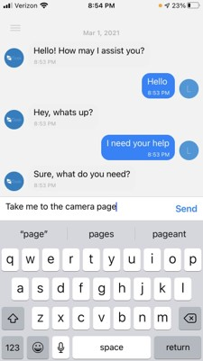
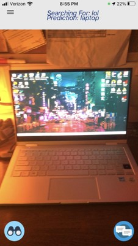
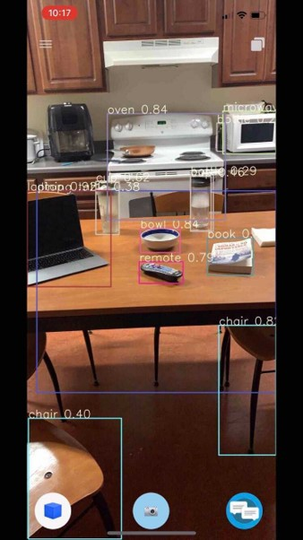

# **iSeek Server Code**
This is a retired repository that houses the software developed for my undergraduate senior project. A team of four developers consisting of two front-end and two back-end engineers produced this application that performs object detection on common items. The intended purpose of the application was to aid a visually impared individual by finding misplaced items using their phones camera and a custom PyTorch object detection network. The application can be used completely hands free thanks to a chat-bot that was developed from scratch by the team using Natural Language Processing and a custom Keras model. The chat-bot code was housed on an AWS instance and is held in [another repository](https://github.com/SamGulinello/ChatBot). The front-end code can also be found [here](https://github.com/MessiahiSeek/iSeek).

# **Final Presentation and App Demo**
It would be difficult to clone all three repositories and get them to run together without our hosting environment to demonstrate this application. Below are a few screenshots that show what the application looks like and its functionality. The team was also required to present the application to a panel and audience remotely at the end of the school year. That presentation was recorded and can be viewed [here](https://youtu.be/YcfFYbgE1T4)

---
 
---